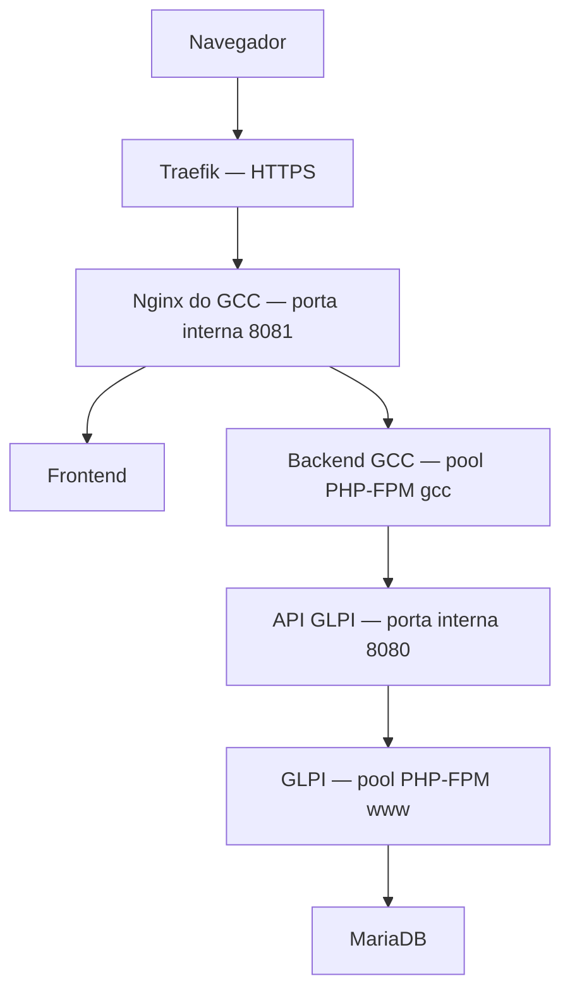

# GLPI Control Center (GCC)

Central operacional de TI do Colégio Satélite, integrada ao GLPI para consulta de ativos, acompanhamento de chamados e organização dos fluxos de assistência técnica.

O GCC reúne informações de inventário, atendimento e fornecedores em uma interface web. O backend em PHP atua como intermediário entre o navegador e a API REST do GLPI, mantendo tokens e credenciais no servidor.

## Acesso

**[Acessar o GLPI Control Center](https://gcc.colegiosatelite.cloud)**

- **GCC:** https://gcc.colegiosatelite.cloud
- **GLPI:** https://glpi.colegiosatelite.cloud

O acesso ao GCC utiliza autenticação Google com conta institucional autorizada do Colégio Satélite. As permissões dependem do perfil do usuário.

## Objetivos

- Centralizar a consulta de ativos e chamados da equipe de TI.
- Reduzir etapas manuais nos processos de atendimento.
- Padronizar a abertura de chamados e os fluxos de assistência.
- Facilitar o acesso aos portais de fornecedores.
- Acompanhar indicadores operacionais.
- Organizar relatórios, registros e informações de suporte.
- Manter as credenciais do GLPI protegidas no backend.

## Funcionalidades

### Inventário

- Consulta de computadores cadastrados no GLPI.
- Consulta de Chromebooks Geekiees.
- Consulta de Chromebooks de apoio agrupados por carrinho.
- Consulta de projetores e impressoras.
- Expansão dos cards de computadores dentro da interface.
- Detalhes organizados em identificação, alocação, dados técnicos e rastreio.
- Edição de campos textuais autorizados.
- Cache no frontend dos detalhes já consultados.

Campos dependentes de dropdowns, entidades, plugins ou relações internas permanecem somente para leitura na versão descrita pelo README original.

### Dashboard operacional

- Organização modular em três camadas: configuração, dados e interface.
- Dez cards distribuídos entre Inventário, Chamados e Status na entrega da Sprint 5.
- Quatro widgets de resumo operacional.
- Atualização automática configurável, com intervalo padrão de cinco minutos.
- Navegação por clique nos cards.
- Indicador de dados desatualizados.
- Loading skeleton e estados de carregamento.
- Layout responsivo.
- Recursos de acessibilidade com ARIA, navegação por teclado e foco visível.
- Estrutura para ampliação dos gráficos e indicadores.

### Chamados e assistência técnica

- Consulta e abertura de chamados no GLPI.
- Fluxo orientado por equipamento e assistência.
- Preenchimento de prioridade, problema e descrição.
- Revisão do resumo antes do envio.
- Encaminhamento para canais de atendimento e portais de fornecedores.

Fluxo de referência:

1. Selecionar o equipamento.
2. Identificar a assistência responsável.
3. Informar prioridade, problema e descrição.
4. Preencher as informações exigidas pelo atendimento.
5. Revisar o resumo.
6. Registrar o chamado no GLPI.
7. Seguir o encaminhamento da assistência.

As regras de mau uso e contrato fazem parte do desenho operacional do projeto. Sua aplicação deve acompanhar o fluxo e o contrato de cada assistência.

### Integrações com fornecedores

| Assistência | Fluxo previsto |
|---|---|
| Torino | Direcionamento ao canal de suporte. |
| HBB | Orientação de entrega do Chromebook ao responsável e comunicação padronizada com a equipe de TI. |
| Acer Geek | Direcionamento ao portal da Acer. |
| Acer | Canal e etapas sujeitos à conclusão do fluxo específico. |

Automação de portais, envio de e-mails e incorporação por iframe devem ser avaliados por fornecedor. O acesso ao portal não implica integração automática com o sistema externo.

### Autenticação e permissões

- Login com Google Identity Services.
- Validação do domínio institucional no backend.
- Controle de permissões por perfil.
- Configuração de administradores autorizados.
- Sessões com prazo de validade configurável.
- Verificação de autenticação nas rotas protegidas.
- Validação de autorização e de token CSRF nas operações que exigem esses controles.

Contas fora dos domínios autorizados são recusadas pelo backend.

## Implantação documentada

A documentação de infraestrutura registra a implantação inicial em **08/09/2026**, com atualização em **09/09/2026**.

| Componente | Tecnologia ou configuração |
|---|---|
| Hospedagem | VPS Hostinger KVM2 |
| Sistema operacional | Ubuntu Server 24.04 LTS |
| Frontend | HTML, CSS e JavaScript |
| Backend | PHP 8.3 |
| Execução PHP | PHP-FPM |
| Servidor web | Nginx nativo |
| Proxy reverso | Traefik em Docker |
| HTTPS | Let's Encrypt, gerenciado pelo Traefik |
| Sistema integrado | GLPI 10.0.19 |
| Banco do GLPI | MariaDB 10.11 |
| Autenticação | Google Identity Services |
| Organização de versões | Releases com link simbólico `current` |

O MariaDB é utilizado pelo GLPI. A integração do GCC com os dados do GLPI ocorre pela API REST.

## Arquitetura



### Comunicação com o GLPI

O navegador faz requisições para `/api/...` no próprio domínio do GCC.

O backend:

1. Abre uma sessão na API do GLPI.
2. Realiza a operação solicitada.
3. Trata os dados retornados.
4. Encerra a sessão do GLPI.
5. Entrega a resposta ao frontend.

Os tokens `App-Token`, `User-Token` e `Session-Token` do GLPI permanecem no servidor.

Na VPS, o backend utiliza o endereço interno do GLPI para evitar uma passagem desnecessária pelo domínio público e pelo Traefik.

### Separação entre GCC e GLPI

| Configuração | GCC | GLPI |
|---|---|---|
| Domínio | `gcc.colegiosatelite.cloud` | `glpi.colegiosatelite.cloud` |
| Endereço interno | `172.18.0.1:8081` | `172.18.0.1:8080` |
| Diretório | `/var/www/gcc/current` | `/var/www/glpi` |
| Área pública | `/var/www/gcc/current/Frontend` | `/var/www/glpi/public` |
| Pool PHP-FPM | `gcc` | `www` |
| Socket PHP-FPM | `/run/php/php8.3-fpm-gcc.sock` | `/run/php/php8.3-fpm.sock` |

Esses endereços internos correspondem ao ambiente documentado e devem ser adaptados em outras instalações.

### Por que o GCC possui um pool PHP-FPM próprio?

Durante a implantação, GCC e GLPI compartilhavam um pool com poucos processos disponíveis.

As consultas simultâneas do GCC ocupavam os processos e, em seguida, aguardavam respostas do GLPI, que precisava de processos do mesmo pool. Isso provocava esgotamento de capacidade e erros de timeout.

A criação do pool `gcc` separou os processos do GCC dos processos utilizados pelo GLPI.

Os pools continuam sob o serviço `php8.3-fpm`; reiniciar esse serviço pode afetar as duas aplicações.

## Estrutura do projeto

A estrutura abaixo reúne os principais arquivos descritos no README de origem e na documentação de implantação.

```text
GLPI-Control-Center/
|-- Backend/
|   |-- .env
|   |-- .env.local.example
|   |-- api/
|   |   |-- endpoints.php
|   |   |-- client.php
|   |   |-- mappers.php
|   |   |-- tickets.php
|   |   |-- chat.php
|   |   `-- utils/
|   |-- config/
|   |-- data/
|   `-- logs/
|-- Frontend/
|   |-- index.html
|   |-- css/
|   |   |-- dashboard.css
|   |   |-- styles.css
|   |   |-- workflow.css
|   |   |-- portal-viewer.css
|   |   `-- search.css
|   `-- javascript/
|       |-- dashboard.config.js
|       |-- dashboard.js
|       |-- dashboard_ui.js
|       |-- app.js
|       |-- auth.js
|       |-- security.js
|       |-- data.js
|       |-- state.js
|       |-- glpi.client.js
|       |-- ui_render.js
|       |-- workflow.js
|       |-- workflow_ui.js
|       |-- workflow.config.js
|       |-- integration-engine.js
|       |-- integration-audit.js
|       |-- integrations.config.js
|       |-- portal-viewer.js
|       |-- portal-viewer.utils.js
|       |-- tickets.js
|       |-- chat.js
|       `-- assistance_flows.js
|-- Docs/
|   |-- Sprint5-TechnicalDocumentation.md
|   `-- Sprint5-Checklist.md
|-- satrt-server.bat
`-- start-local.bat
```

O nome `satrt-server.bat` foi preservado conforme o README de origem. Qualquer renomeação deve ser acompanhada da atualização das referências no código.

O arquivo `.env` é criado no ambiente de execução e não deve ser versionado com credenciais.

## Endpoints documentados

| Método | Rota | Descrição |
|---|---|---|
| GET | `/api/health` | Verificação pública de disponibilidade do backend. |
| GET | `/api/assets/computers` | Lista resumida de computadores. |
| GET | `/api/assets/computers/{id}` | Detalhes estruturados de um computador. |
| POST | `/api/assets/computers/{id}` | Atualiza campos editáveis de um computador. |
| GET | `/api/assets/chromebooks-geekiees` | Lista de Chromebooks Geekiees. |
| GET | `/api/assets/chromebooks-apoio` | Lista de Chromebooks de apoio por carrinho. |
| GET | `/api/assets/projetores` | Lista de projetores. |
| GET | `/api/assets/impressoras` | Lista de impressoras. |
| GET | `/api/tickets` | Lista de chamados. |
| POST | `/api/tickets` | Cria um chamado no GLPI. |
| POST | `/api/chat` | Assistente de horários. |

As rotas de dados exigem autenticação e as permissões correspondentes.

O endpoint `/api/dashboard` aparece no planejamento técnico como melhoria futura e não é apresentado como rota já disponível.

## Configuração de produção

Arquivo de ambiente:

```text
/var/www/gcc/current/Backend/.env
```

Exemplo com valores ilustrativos:

```env
APP_ENV=production

AUTH_SESSION_SECRET=SUBSTITUA_POR_UM_SEGREDO_ALEATORIO
AUTH_SESSION_TTL=43200
AUTH_ALLOWED_DOMAINS=colegiosatelite.com.br
AUTH_ADMIN_EMAILS=

GLPI_URL=http://172.18.0.1:8080/apirest.php
GLPI_APP_TOKEN=SUBSTITUA_PELO_APP_TOKEN
GLPI_USER_TOKEN=SUBSTITUA_PELO_USER_TOKEN
GLPI_SSL_INSECURE=0

CORS_ORIGIN=https://gcc.colegiosatelite.cloud

GOOGLE_CLIENT_ID=SUBSTITUA_PELO_CLIENT_ID
OPENAI_API_KEY=
```

| Variável | Finalidade |
|---|---|
| `APP_ENV` | Ambiente de execução. |
| `AUTH_SESSION_SECRET` | Segredo utilizado pelas sessões do GCC. |
| `AUTH_SESSION_TTL` | Validade da sessão, em segundos. |
| `AUTH_ALLOWED_DOMAINS` | Domínios de e-mail autorizados. |
| `AUTH_ADMIN_EMAILS` | Contas com acesso administrativo. |
| `GLPI_URL` | Endereço da API REST do GLPI acessado pelo backend. |
| `GLPI_APP_TOKEN` | Token da aplicação no GLPI. |
| `GLPI_USER_TOKEN` | Token do usuário de integração. |
| `GLPI_SSL_INSECURE` | Controle da verificação de certificado nas conexões HTTPS. |
| `CORS_ORIGIN` | Origem autorizada da aplicação. |
| `GOOGLE_CLIENT_ID` | Identificador do cliente Google OAuth. |
| `OPENAI_API_KEY` | Chave dos recursos de IA, quando utilizados. |

Para gerar um segredo de sessão:

```bash
openssl rand -hex 32
```

Armazene o valor gerado somente na configuração protegida. A alteração de `AUTH_SESSION_SECRET` invalida as sessões existentes.

### Google OAuth

No cliente OAuth do GCC, configure a seguinte origem JavaScript autorizada:

```text
https://gcc.colegiosatelite.cloud
```

A origem deve ser cadastrada sem barra final e sem `/api`.

A restrição de domínio é validada no backend por `AUTH_ALLOWED_DOMAINS`.

### Configuração esperada no frontend

Na implantação documentada:

```javascript
window.APP_ENV
// "production"

window.CONFIG.mode
// "server"

window.CONFIG.backendUrl
// "https://gcc.colegiosatelite.cloud"

window.CONFIG.glpiUrl
// "https://glpi.colegiosatelite.cloud"
```

A URL pública do GLPI no frontend não substitui `GLPI_URL` do backend, que utiliza o endereço interno.

## Execução local

O procedimento abaixo foi preservado do README de desenvolvimento:

1. Copie `Backend/.env.local.example` para `Backend/.env.local`.
2. Configure a conexão com seu GLPI de desenvolvimento.
3. Ajuste os parâmetros de autenticação para o ambiente local.
4. Execute `start-local.bat`.
5. Acesse `http://localhost:3000/?mode=local`.

O backend carrega `Backend/.env` e aplica as sobrescritas de `Backend/.env.local`, quando esse arquivo existe.

No comportamento local originalmente documentado:

- Frontend: `http://localhost:3000`.
- Backend: `http://localhost:8080`.
- GLPI local: `http://localhost/glpi`.
- `?mode=local` força a seleção do ambiente local.

Confirme esses valores nos scripts da versão utilizada. As portas de desenvolvimento não correspondem às portas internas da implantação na VPS.

### Inicialização manual de desenvolvimento

Backend:

```powershell
cd Backend/api
php -S 127.0.0.1:9090 endpoints.php
```

Frontend, em outro terminal:

```powershell
cd Frontend
php -S 127.0.0.1:4000
```

Para esse modo manual, configure o frontend para acessar o backend na porta `9090`.

A implantação de produção utiliza Nginx e PHP-FPM.

## Operação na VPS

### Arquivos principais

| Item | Caminho |
|---|---|
| Versão ativa | `/var/www/gcc/current` |
| Releases | `/var/www/gcc/releases` |
| Ambiente | `/var/www/gcc/current/Backend/.env` |
| Dados graváveis | `/var/www/gcc/current/Backend/data` |
| Logs da aplicação | `/var/www/gcc/current/Backend/logs` |
| Nginx do GCC | `/etc/nginx/sites-available/gcc` |
| Pool PHP-FPM do GCC | `/etc/php/8.3/fpm/pool.d/gcc.conf` |
| Rota dinâmica do Traefik | `/root/traefik-dynamic/gcc.yml` |

### Verificação de disponibilidade

```bash
# Frontend
curl -I https://gcc.colegiosatelite.cloud

# Backend
curl -i https://gcc.colegiosatelite.cloud/api/health

# Rota protegida sem autenticação
curl -i https://gcc.colegiosatelite.cloud/api/assets/computers
```

Resultados esperados:

- Frontend: HTTP `200`.
- Health check: HTTP `200`.
- Rota protegida sem autenticação: HTTP `401`.

Resposta de referência do health check:

```json
{
  "ok": true,
  "service": "glpi-control-center-backend",
  "env": "production"
}
```

### Verificação de serviços

```bash
sudo systemctl status nginx --no-pager
sudo systemctl status php8.3-fpm --no-pager
sudo systemctl status mariadb --no-pager
sudo docker ps
```

### Validação de configuração

```bash
sudo nginx -t
sudo php-fpm8.3 -t
```

Valide as configurações antes de recarregar ou reiniciar serviços.

## Atualização e rollback

A implantação utiliza diretórios de release e um link simbólico `current` apontando para a versão ativa.

### Processo de atualização

1. Registrar o commit que será implantado.
2. Fazer backup da configuração e dos dados graváveis.
3. Preparar a nova versão em um diretório separado.
4. Disponibilizar o `.env` protegido na nova release.
5. Preservar ou migrar os dados graváveis necessários.
6. Validar a sintaxe de PHP e JavaScript.
7. Testar a nova versão.
8. Atualizar o link `current`.
9. Validar o health check, o login e as rotas protegidas.
10. Manter a versão anterior disponível.

Validação sintática, na raiz da release:

```bash
find Backend -type f -name "*.php" -print0 | xargs -0 -n1 php -l
find Frontend -type f -name "*.js" -print0 | xargs -0 -n1 node --check
```

O Node.js é utilizado nesse comando para validar JavaScript.

Verificação da versão ativa:

```bash
readlink -f /var/www/gcc/current
```

### Rollback

O rollback do código consiste em apontar `current` novamente para a release anterior e validar a aplicação.

Antes da troca, verifique a compatibilidade de configuração e dos dados graváveis. Reverter o código não desfaz operações já registradas no GLPI nem restaura automaticamente dados locais.

A separação de `Backend/data` e `Backend/logs` para diretórios persistentes fora das releases permanece como melhoria técnica recomendada.

## Diagnóstico

| Sintoma | Verificações principais |
|---|---|
| Site não abre | DNS, certificado, Traefik, Nginx e porta interna do GCC. |
| HTTP 502 | Socket PHP-FPM, pool `gcc`, permissões e logs. |
| HTTP 504 | Tempo de resposta do GLPI, consultas simultâneas e capacidade dos pools. |
| HTTP 401 | Sessão ausente ou expirada, cookies e configuração HTTPS. |
| HTTP 403 | Domínio autorizado, perfil, permissões e CSRF. |
| HTTP 404 | Rota da API, arquivo solicitado e roteamento do Nginx. |
| Dashboard sem dados | Requisições `/api/`, configuração do frontend e comunicação com o GLPI. |
| Login Google não abre | Origem OAuth autorizada, CSP e extensões do navegador. |

### Logs

```bash
# Nginx
sudo tail -n 100 /var/log/nginx/error.log

# Pool PHP-FPM do GCC
sudo tail -n 100 /var/log/php8.3-fpm-gcc.log

# Serviço PHP-FPM
sudo journalctl -u php8.3-fpm --since "30 minutes ago" --no-pager

# Traefik
sudo docker logs --tail 100 root-traefik-1
```

O socket configurado no Nginx deve corresponder exatamente ao socket do pool:

```text
/run/php/php8.3-fpm-gcc.sock
```

Respostas HTTP `206` do GLPI podem representar paginação e não significam necessariamente uma falha.

## Segurança e manutenção

- Manter tokens, senhas e segredos fora do repositório.
- Servir somente o diretório `Frontend` como área pública do GCC.
- Proteger o `.env` e os diretórios graváveis.
- Manter a validação de autenticação e autorização no backend.
- Manter HTTPS público gerenciado pelo Traefik.
- Não expor diretamente as portas internas do GCC, GLPI ou MariaDB.
- Preservar os serviços existentes na VPS durante alterações.
- Manter backups separados do GCC e do GLPI.

Na infraestrutura documentada, as portas públicas `80` e `443` pertencem ao Traefik. O Nginx utiliza os endereços internos definidos para cada aplicação.

## Histórico de entregas

### Implantação na VPS — setembro de 2026

- Publicação do GCC em `gcc.colegiosatelite.cloud`.
- Integração com o GLPI hospedado na mesma VPS.
- Roteamento HTTPS pelo Traefik.
- Certificado Let's Encrypt.
- Nginx dedicado ao domínio do GCC.
- Pool PHP-FPM exclusivo para o backend.
- Autenticação Google com domínio institucional.
- Proteção das rotas de dados.
- Ajustes de CSP e cabeçalhos relacionados ao login.
- Organização da implantação em releases.

### Sprint 5 — Dashboard Operacional

- Dashboard modular em três camadas.
- Dez cards em três grupos.
- Quatro widgets operacionais.
- Atualização automática configurável.
- Navegação por clique.
- Indicador de dados desatualizados.
- Loading skeleton.
- Responsividade e recursos de acessibilidade.

### Sprint 4 — Integrações

- Cards expansíveis de computadores.
- Detalhes organizados por categoria.
- Edição de campos textuais no GLPI.
- Cache de detalhes no frontend.
- Detecção do ambiente local.
- Seleção de ambiente por parâmetro de URL.

## Próximas atualizações

### Desempenho e infraestrutura

- [ ] Implementar cache temporário de inventário no backend.
- [ ] Criar um endpoint agregado `/api/dashboard`.
- [ ] Mover dados e logs para diretórios persistentes fora das releases.
- [ ] Adicionar cache de arquivos estáticos com versionamento.
- [ ] Separar logs de aplicação, auditoria e integração.
- [ ] Configurar monitoramento de disponibilidade e recursos.
- [ ] Automatizar validação, deploy e rollback.

### Dashboard e interface

- [ ] Ampliar gráficos e filtros por período.
- [ ] Consolidar chamados em aberto por estado.
- [ ] Destacar a distribuição de ativos por tipo.
- [ ] Revisar carregamento dos ícones e estados de erro.
- [ ] Aprimorar a pesquisa global.
- [ ] Ajustar sidebar e identificação visual do GCC.

### Atendimento e relatórios

- [ ] Concluir e validar os fluxos pendentes por assistência.
- [ ] Implementar comunicações padronizadas.
- [ ] Permitir anexos e evidências nos chamados.
- [ ] Criar templates por equipamento e problema.
- [ ] Adicionar aprovação ou recusa com justificativa.
- [ ] Ampliar relatórios operacionais e registros de avisos.
- [ ] Consolidar horas de uso dos projetores a partir dos registros disponíveis.
- [ ] Avaliar automações compatíveis com os portais dos fornecedores.

## Documentação

- `Docs/Sprint5-TechnicalDocumentation.md`
- `Docs/Sprint5-Checklist.md`
- Documentação interna de infraestrutura e operação: **DOCUMENTAÇÃO VPS KVM2**, seção **Doc. GCC**, atualizada em **09/09/2026**.

Este README descreve o projeto com base nas entregas registradas e na documentação de implantação. As configurações de infraestrutura são referências do ambiente do Colégio Satélite e devem ser adaptadas para outras instalações.
